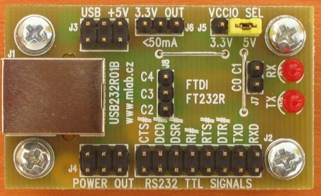

[Czech](./README.cs.md)
<!--- module --->
# USB232R01B
<!--- Emodule --->

<!--- subtitle ---> USB to RS232 TTL converter <!--- Esubtitle --->

<!--- description ---> The module is universal converter from USB to RS232 with TTL/CMOS signal levels (both 3.3V and 5V). The converter uses FT232R chip from FTDI and is supported in all main operating systems.<!--- Edescription --->
            
